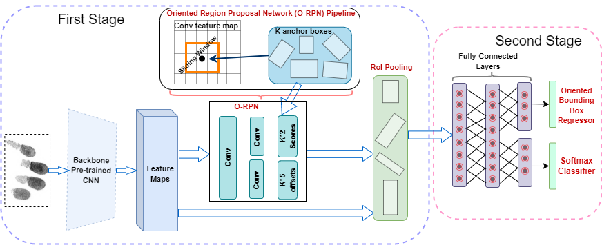

## Project Title: Clarkson Rotated Fingerprint Segmentation (CRFSEG) system 
This repository is associated with a research initiative exploring deep learning-based solutions for slap fingerprint segmentation. It contains the code for the CRFSEG (Clarkson Rotated Fingerprint Segmentation) model, specifically designed to segment slap fingerprint images. It also contains code to develop a transformer-based slap segmentation system (TransSEG) by leveraging [FPNFormer](https://ieeexplore.ieee.org/abstract/document/10384424). 

## Project Overview
[Deep Age-Invariant Fingerprint Segmentation System](https://arxiv.org/pdf/2303.03341).

In this research, we developed a deep learning-based method for generating arbitrarily angled bounding boxes to precisely localize and
label fingerprints in both axis-aligned and over-rotated slap images. We present CRFSEG (Clarkson Rotated Fingerprint Segmentation
Model), an improvement upon the Faster R-CNN algorithm, incorporating arbitrarily-angled bounding boxes for enhanced performance
on challenging slap images. Here is the complete architecture of the Clarkson Rotated Fingerprint Segmentation (CRFSEG) system.



CRFSEG demonstrates consistent results across different age groups and effectively handles over-rotated
slap images. We evaluated CRFSEG against the widely used slap segmentation systems NFSEG and VeriFinger. Additionally, we
leveraged a transformer-based vision architecture to build TransSEG (Transformer-based Slap Segmentation System), a new model for
further comparison of CRFSEG with state-of-the-art deep learning-based image segmentation models.

## Key features
1. CRFSEG accurately segments slap fingerprint images, producing precise bounding boxes around each fingerprint and classifying them correctly.
2. CRFSEG is age and orientation invariant, capable of processing slap images from various age groups and orientations.
3. It is also easily deployable and adaptable to new datasets with minimal fine-tuning using a small number of images.  

## Contributions

1. Two new in-house large datasets named Combined and Challenging slap datasets contain 133,611 slap fingerprint images of children and adults.
2. Annotated all slap fingerprint images manually to establish a ground-truth baseline for the accuracy assessment of different fingerprint segmentation systems.
3. Developed a novel age-invariant deep learning-based slap segmentation model (viz. CRFSEG), that can handle arbitrarily oriented fingerprints of adult and juvenile subjects.
4. Built a transformer-based fingerprint segmentation model named TransSEG to compare CRFSEG with this state-of-the-art deep learning model.
5. Evaluated the performance of state-of-the-art commercial and non-commercial fingerprint segmentation systems named VeriFinger, and NFSEG on our noble dataset and compared the performance of these systems with the newly developed CRFSEG model and also compared with TransSEG.
6. Released trained CRFSEG and TransSEG models through GitHub for public use.

## Data Availability Statement
The fingerprint dataset used in this research, collected under IRB-approved protocol, contains sensitive information about juvenile subjects and cannot be publicly shared due to legal and ethical constraints. However, to facilitate further research, interested parties can provide their code/models to the corresponding authors. The authors will evaluate the provided code/models on the slap fingerprint dataset and share the anonymized results with the requesting party.


## Pre-trained model
* A pre-trained model is stored in the trained_model folder.

## Test images 
* A few test images are stored in the test_image folder to test the model.

## How to run the pre-trained model on an image
* The CRFSEG.ipynb file contains the necessary code to run the model. 
* Run Jupiter notebook on your computer and execute the code inside CRFSEG.ipynb file.
* The final cell of the notebook code will show the output images containing the labels and bounding boxes around the fingerprints.

## Citation
If you find this work useful in your research, please cite our paper:
### Citation

```bibtex
@article{murshed2023deep,
  title={Deep Age-Invariant Fingerprint Segmentation System},
  author={Murshed, MG and Bahmani, Keivan and Schuckers, Stephanie and Hussain, Faraz},
  journal={arXiv preprint arXiv:2303.03341},
  year={2023}
}
